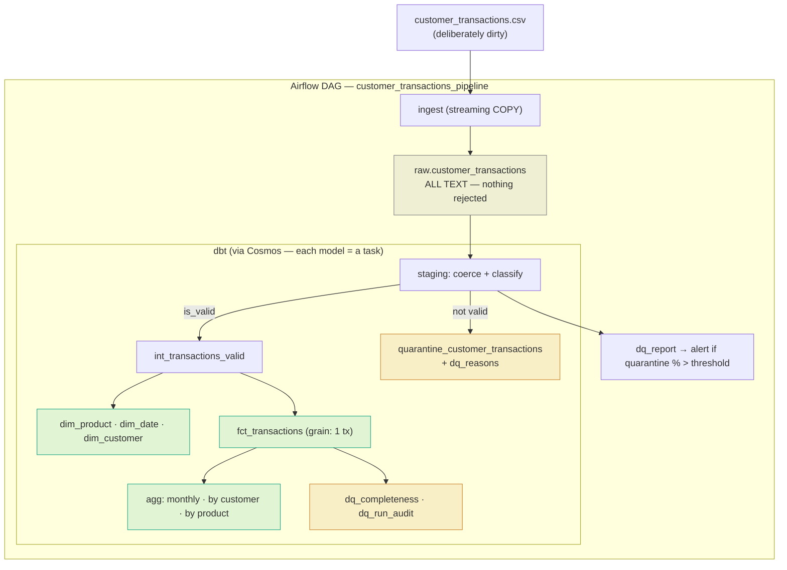
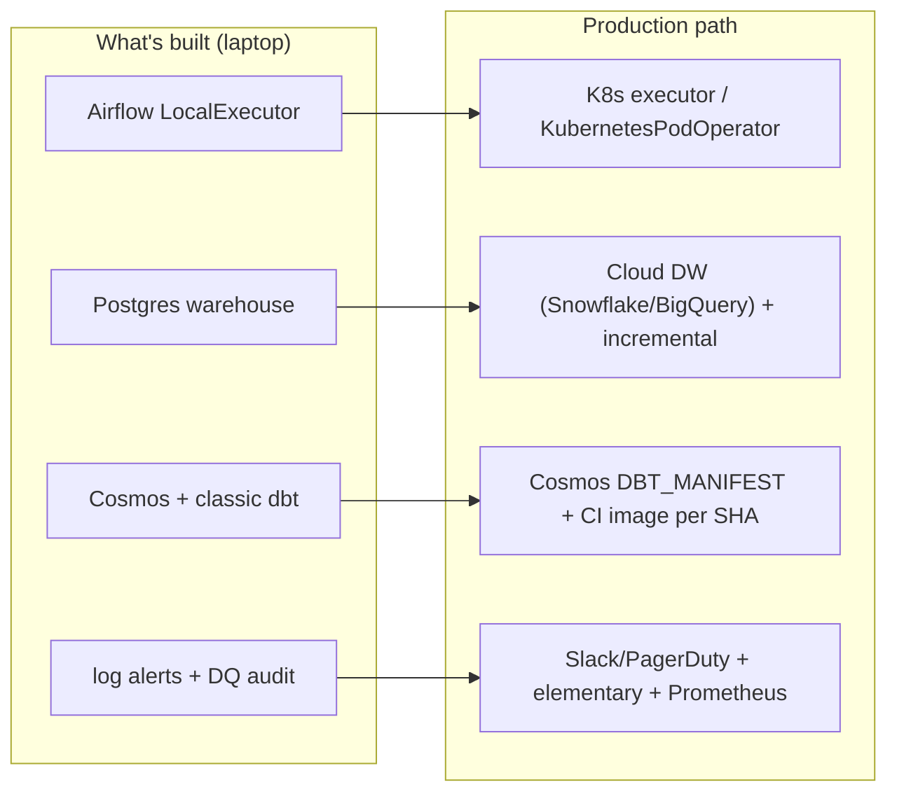

# Architecture & Trade-offs

> A single read-through of the whole system: **what** it does, **why** it's built this way,
> what was **kept simple on purpose**, and **how it scales to production**. Written to be
> presented — skim the diagram and tables, dive into the sections you want.

---

## 1. The big picture

One Airflow DAG ingests a CSV into Postgres, then dbt (rendered per-model by Cosmos) cleans
it, splits good from bad, and builds a star schema with aggregates — all in containers,
deployable with `docker compose up`.

**Layers (the "dbt way"):** `staging` (clean/classify) → `intermediate` (clean set) →
`marts` (star + aggregates + DQ), landing in **separate schemas** (`staging`, `analytics`),
with the audit/test-failures in `dq_audit`.

---

## 2. Follow the data (the fastest way to understand it)

Take four rows from the source and watch what happens to each:

| Source row | Issue | What the pipeline does |
|------------|-------|------------------------|
| `1001, 501.0, 2023-07-11, 101, Product A, 1, 76.27, 8.23` | clean-ish | `501.0`→`501`, dates parsed → **fact row** |
| `T1010, 500.0, …, P100, …, 4, 200.35, 17.34` | `T`/`P` prefixes | prefixes stripped (`T1010`→`1010`, `P100`→`100`) → **fact row** |
| `1007, (empty), …, 5, 78.28, 18.24` | missing customer | kept, mapped to **unknown customer (-1)**, flagged → **fact row** |
| `1009, 509.0, …, 5, Two Hundred, 10.69` | price is a word | amount can't be computed → **quarantined** with reason `price_not_numeric` |

**The rule in one line:** recover formatting where safe; **quarantine** a row only when its
*amount* can't be computed (bad `price`/`tax`/`quantity`); **flag** (don't drop) a row that's
usable but missing a *dimension* like the customer.

Result on the 100-row sample: **61 clean + 10 flagged = 71 modelled, 29 quarantined** — and
`dq_completeness` proves `71 + 29 = 100` (nothing lost).

---

## 3. Key decisions & trade-offs

Each links to its full [ADR](adr/README.md).

| Decision | Why | Trade-off | Revisit when |
|----------|-----|-----------|--------------|
| **ELT** — land raw as TEXT, clean in dbt | dirty values survive ingest; immutable source of truth; reproducible | raw isn't query-ready | — (it's the right default) |
| **Cosmos** for dbt-in-Airflow ([0001](adr/0001-dbt-orchestration.md)) | per-model tasks (retries/lineage in the UI); dbt env isolated from Airflow's | a bit of config; needs deps at render | moving to k8s → Cosmos k8s mode |
| **Quarantine on broken measure; flag missing customer** ([0005](adr/0005-data-quality-strategy.md)) | don't drop revenue over a missing key; don't invent monetary values | 29% segregated on this (dirty) sample | business wants imputation |
| **`tax` = absolute amount** ([0005](adr/0005-data-quality-strategy.md)) | proven: ~0 correlation with price, continuous values | — | source semantics change |
| **Model contracts** on dims/fact | stable, typed interface for consumers | schema changes need an explicit update | — (that's the point) |
| **Config via `${VAR:-default}`** ([0002](adr/0002-configuration-and-secrets.md)) | zero-setup `docker compose up`; no secrets committed | local defaults only | any real deployment → secrets manager |
| **Classic dbt-core** ([0003](adr/0003-pin-classic-dbt-engine.md)) | dbt 2.0 "Fusion" dropped Postgres | not on the newest engine | Fusion supports Postgres / cloud DW |
| **Bake code into the image** ([0004](adr/0004-project-code-baked-into-image.md)) | immutable, shippable artifact; mounts override for dev | rebuild to ship changes | — |

---

## 4. What we kept simple — on purpose

Senior judgment is as much about what you *don't* build. Each of these is the right call
*at this scale*, with a known upgrade path:

| Kept simple | Why it's fine here | Upgrade path |
|-------------|--------------------|--------------|
| **LocalExecutor** | one box, low volume | Celery / Kubernetes executor |
| **Single Postgres warehouse** | 100 rows; brief says Postgres | cloud DW (Snowflake/BigQuery/Redshift) |
| **Full-refresh marts** | tiny dataset; simplest & idempotent | incremental models (`unique_key`) |
| **Log-based alerting** (webhook-ready) | works offline/in-review; no secret to commit | wire the webhook to Slack/email |
| **Lightweight DQ audit** | self-contained, testable | `elementary-data` (history + anomalies + report) |

---

## 5. Scaling to production

- **Orchestration:** Cosmos `LoadMode.DBT_MANIFEST` (bake the manifest → no `dbt deps` at
  DAG parse); `KubernetesPodOperator` for isolated per-run pods; Celery/K8s executor.
- **Warehouse & modelling:** a cloud warehouse (unlocks dbt Fusion), **incremental** fact &
  audit models, snapshots for slowly-changing dimensions, partitioning/clustering.
- **CI/CD:** GitHub Actions — `sqlfluff` lint, `dbt build` on throwaway Postgres, **slim CI**
  (`state:modified`), build & tag the image per git SHA, dbt **unit tests** (1.8+).
- **Observability:** `elementary-data` for test history & anomaly detection; Airflow metrics
  → Prometheus/Grafana; the notifier's transport swapped to real Slack/email.
- **Governance (fintech-relevant):** data catalog + lineage (dbt docs/exposures), **grants
  per schema**, PII tagging & masking, retention policies, richer `dbt_expectations`.
- **Security:** secrets from a manager (AWS/GCP/Vault), least-privilege DB roles, image
  scanning in CI.

---

## 6. Prioritized enhancements (impact × effort)

| Enhancement | Impact | Effort | Priority |
|-------------|:------:|:------:|:--------:|
| Cosmos `DBT_MANIFEST` (no deps at parse) | High | Low | **1** |
| CI: `dbt build` + image per SHA | High | Med | **2** |
| Incremental fact/audit models | Med | Low | **3** |
| Real alert transport (Slack) | Med | Low | **4** |
| `elementary-data` observability | Med | Med | 5 |
| Cloud warehouse + Fusion | High | High | 6 |
| K8s executor / pods | Med | High | 7 |

---

## 7. Cheat-sheet for the call

Six things worth saying out loud:

1. **"I landed raw as text on purpose."** ELT — the dirty data survives ingest; dbt owns
   cleaning. Immutable source of truth.
2. **"Nothing is dropped silently."** Coerce / quarantine / flag, with reasons, and a
   completeness metric that reconciles to 100.
3. **"dbt is decoupled from Airflow."** Isolated venv + Cosmos per-model tasks — the failure
   mode I designed against is dependency conflicts.
4. **"tax is an absolute amount — and I proved it"** (correlation ≈ 0), rather than guessing.
5. **"Contracts + separate schemas + tests"** give consumers a stable interface — governance,
   not just transformation.
6. **"I know what I deliberately kept simple"** (LocalExecutor, Postgres, full-refresh) and
   the exact upgrade path for each.

> One honest example to tell: during clean-room verification I found Cosmos was running
> `dbt deps` **per task** (~40×), making a run take 5 minutes. LOCAL execution runs in the
> project dir where packages are already baked, so I removed the per-task install — the
> pipeline dropped to **36 seconds**. That's the platform mindset: measure, find the waste,
> fix it.
